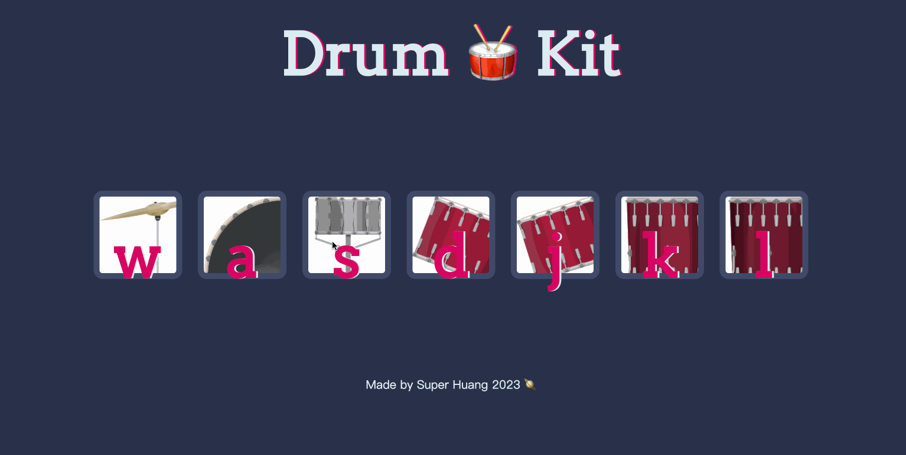

# Drum Kit
This is a drum kit player. 
Tech:js-DOM

---
#Screenshot


---

What we want to achieve:
**action/event:**
click the button
press the key with the same letter as the button

**result:**
make sound and button shadow for a while

**Knowledge base:**
1. pre-define function
- set button sound:
  - switch
  - DOM:new audio, play()
- set button style
  - save style to class
  - add and remove class for the clicked button(DOM)
  - ⭐️ set styling time: setTimeOut();

2. apply the function for each button based on condition
- configure the first eventlistener:click, loop each button
- configure the first eventlistener:keypress
- event result: apply those two pre-defined functions using input

---

1. button sound
create makesound function: makesound for each button
- use switch to slelect each button
- create audio object for each button
- trigger play() when matches the condition
**switch statement**
```
function name(content){
    switch(content){
        case "":
        statement;
        break;

        case "":
        statement;
        break;

        default:statement;
    }
}
```
**htmlaudio element**
provides access to properties of the `<audio>` element and methods to manipulate them
**html audio DOM play() method**
```
var tom1 = new Audio("sounds/tom-1.mp3");
tom1.play();
```

2. button style:
create buttonAnimation function:when click event happens, get the shadow style for the button for a while and then disappear.
- save the shadow style in css "pressed" class
- select the active button and add "pressed" class, `use.classList.add("");`
- ⭐️remove class after a while
`setTimeout(function,time);`
```
setTimeout(function () {
        activeButton.classList.remove("pressed");
    }, 100);
```

3. eventlistener
- configure the first eventlistener:"click"
  - loop: for each button
  `.addEventListener("click",function(){this.})`
  - select the innerhtml as input
  `this.innerHTML`
  - apply those two pre-defined functions using input
- configure the second eventlistener:"keypress"
  - when press the key with the same letter as button innerhtml, apply the functions
  - get event key
  ```
  document.addEventListener("keypress",function(event){
    console.log(event.key);
  })
  ```
  - add event for the whole document
