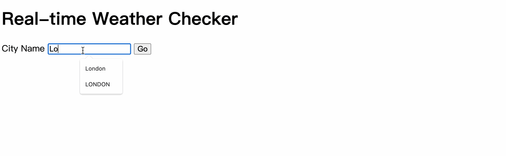

# Real-time Weather Checker
This is a weather app where you can search for the real-time weather conditions of any location.

# Screenshot


---

**Tech:**
- node.js:express, body-parser module
- open weather API & http module(build-in):
  - get data from external website
- postman:test external API

**work flow**
- external resources(openweather)>>>
- API(url- endpoint,params,paths,authen)>>>
  - parse html data to get complete url(node.js body-parser)>>>
- make request to the extrenal server with url(http module)>>>
- parse json format data to js object(http module)
- retrive data to get specific values(json viewer extension)>>>
- render page(node express.js)

📜
- key points
- main concepts
- instruction of getting and transfer api data, render website

---

## key points:
1. concept:
  - node.js/node native&external modules
  - API/JSON/HTTP/http module
2. make request to the external website(openweather) through `API`
  - get url:Endpoints, paths, parameters, authentition
  - ⭐️ `http module`: 
  ```
  http.get(url,function(res){
   res.on("data",function(data){
    //parse,manipualte,render
   })
  });
  ```
3. check the data in the form of json object
  - extension `json viewer`
4. parse json into js and send the needed data
  - `http module`: `JSON.parse(data);`
5. render a website 
  - use `express module`: multiple `res.write()` and one `res.send`
6. use http status code to debug with the dev tool
7. use *postman* to test api:
  - enter url endpoint to get, enter key and value in param, click send, get the json object, check the status code in test result

---

### Concepts
1. node.js: 
  - js runtime environment
  - interect with local file
  - code in commandline with hyper
2. node native modules: 
  - ex. fs
3. node external modules: 
  - npm:node package manager
  - ex. express
⭐️ difference between express.js and jquery
  -	Express.js: web framework(mobile and web),**server side**
    - With HTTP utility methods and middleware
    - HTTP:
      - Hypertext Transfer Protocol
      - is used to load webpages using hypertext links
    - get method:respond to requests with HTML files
    - post method:Processing post requests with **body parser**
      - **body parser**: parse form data in html
  - Jquery: JavaScript library, use in html page for DOM 
            manipulation, **client side** programming

4. API:
- (input-in the form of key value pair)
  - Endpoints:start of the url
  - paths:planned customization
  - parameters: specific query
  - authentition:id
- JSON data:received from API
- API tool:**Postman**-test api
  - enter endpoint in get,enter key and value, then press send, get the json data, check status code in test

5. JSON
- Javascript object notation
- extension-**JSON viewer**:turn json into [json object](https://api.openweathermap.org/data/2.5/weather?q=london&appid=26e2be791fa988fca83ac3eeb8ad7c93&units=metric)

6. HTTP
- debug:check http code with dev tool
- Console--network--see the working flow
- [Http response status code](https://developer.mozilla.org/en-US/docs/Web/HTTP/Status)

---

## app.post page steps:
1. get url from the api website
the composition of url:
⭐️ [openweather API](https://openweathermap.org/current)(call current weather data)
url + specific user id + specific query + specific units
2. use http module to get data from the url
[http module](https://nodejs.org/api/http.html#httpgeturl-options-callback)
  - allow node.js to transfer data over the Hyper Text Transfer 
    Protocol (HTTP) 
  - only need to require it
⭐️ template for getting data from external server
```
http.get(url, function (response) {
 response.on("data", function (data) {
 res.send();
 })})
```
3. parse JSON
- get data in the form of json(enter url)(with the extension json viewer)
[json data](https://api.openweathermap.org/data/2.5/weather?q=london&appid=26e2be791fa988fca83ac3eeb8ad7c93&units=metric)
- ⭐️ Parse json(as string) into actual javascript object(without "" in variable name)`const name = JSON.parse(data);`
  - Opposite- js to json `const jsonData = JSON.stringify(data);`
4. get final data
- use extension [JSON viewer]((https://api.openweathermap.org/data/2.5/weather?q=london&appid=26e2be791fa988fca83ac3eeb8ad7c93&units=metric)) to retrive the data we want
- get icon url through retriving the number of the weather icon 
[weather icon](https://openweathermap.org/weather-conditions)
5. send data to render website
- Use express to render a website with live api data
- res.send can only be called once in a code
- ⭐️ res.write- can be called more times
```
res.write();
res.write("");
res.send();
```


